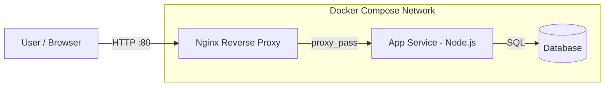

# Architecture — Dockerized Multi-Container Web Application

A multi-container application orchestrated with Docker Compose: Nginx reverse proxy in front of an app service backed by a database.

## How it works

- Nginx acts as the reverse proxy and single entry point on port 80.
- Requests are forwarded to the application service running the Node.js server.
- The app service reads and writes data to the database service.
- All services run on a shared Docker Compose network and are defined in docker-compose.yml.
