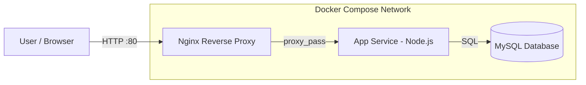

# Dockerized Multi-Container Web Application

This project demonstrates a multi-container web application using Docker Compose, Nginx reverse proxy, a Node.js API service, and a MySQL database.

## Skills Covered

- Docker
- Docker Compose
- Nginx reverse proxy
- Multi-container architecture
- Service networking
- Environment variables

## Architecture



> Full diagram details: [ARCHITECTURE.md](ARCHITECTURE.md)

## Project Structure

```text
app/                  Node.js API service
db/                   Database initialization SQL
nginx/                Reverse proxy configuration
docker-compose.yml    Multi-container stack
.env.example          Example environment variables
```

## Run

```bash
cp .env.example .env
docker compose up --build
```

Open: http://localhost:8080

## Stop

```bash
docker compose down
```

## Cleanup and Security

Remove local containers, network and volumes after testing:

```bash
docker compose down -v
```

Do not commit `.env` files, database dumps or credentials. Use a local `.env` file and keep only `.env.example` in source control.
